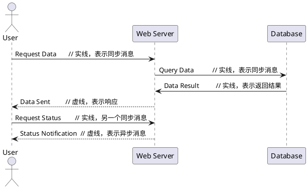

# 序列图

## 基本组成

- `对象`：序列图中的每个对象用矩形表示，通常在顶部水平排列。对象的名称通常在矩形中。
- `生命线`：每个对象下面有一条垂直的虚线，表示该对象的生命期。
- `消息`：对象之间的消息通过水平箭头表示。箭头的方向表示消息的发送者和接收者。消息可以是同步（实线箭头）或异步（虚线箭头）。
- `激活框`：表示对象在某个时间段内活跃的区域，通常用矩形框表示在生命线上。

## 消息类型

- 同步消息：发送后等待响应，通常用于方法调用。表示为**实线带箭头**的箭头。`->` `<-`
- 异步消息：发送后不等待响应，通常用于事件通知。表示为**虚线带箭头**的箭头。 `-->` `<--`
- 返回消息：表示方法调用的返回，通常用带有**虚线**的箭头表示。

## 时间顺序
序列图按照时间的顺序自上而下排列。上面的消息先发送，下面的消息后发送。